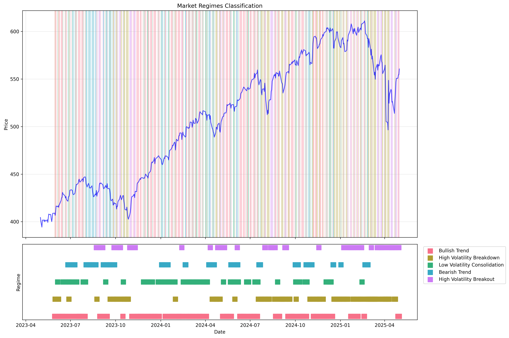
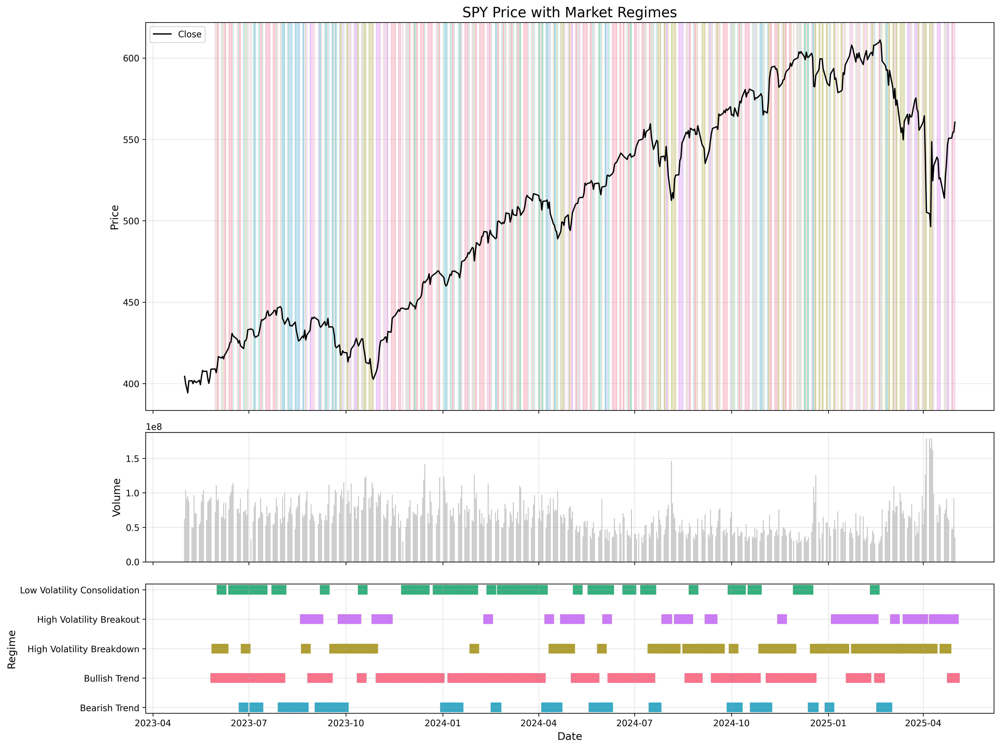
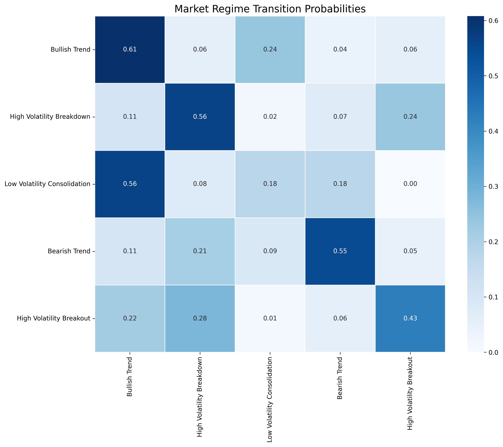
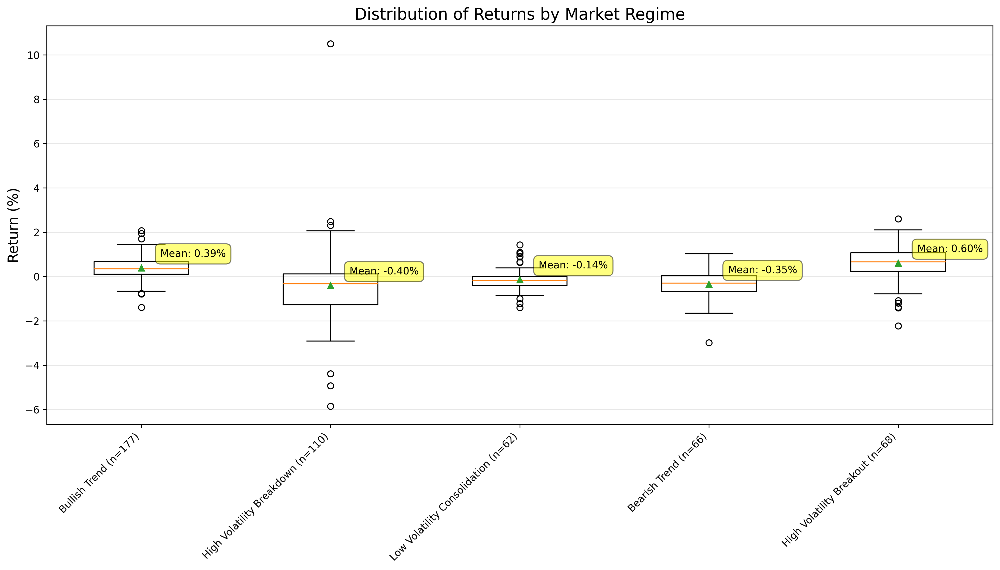
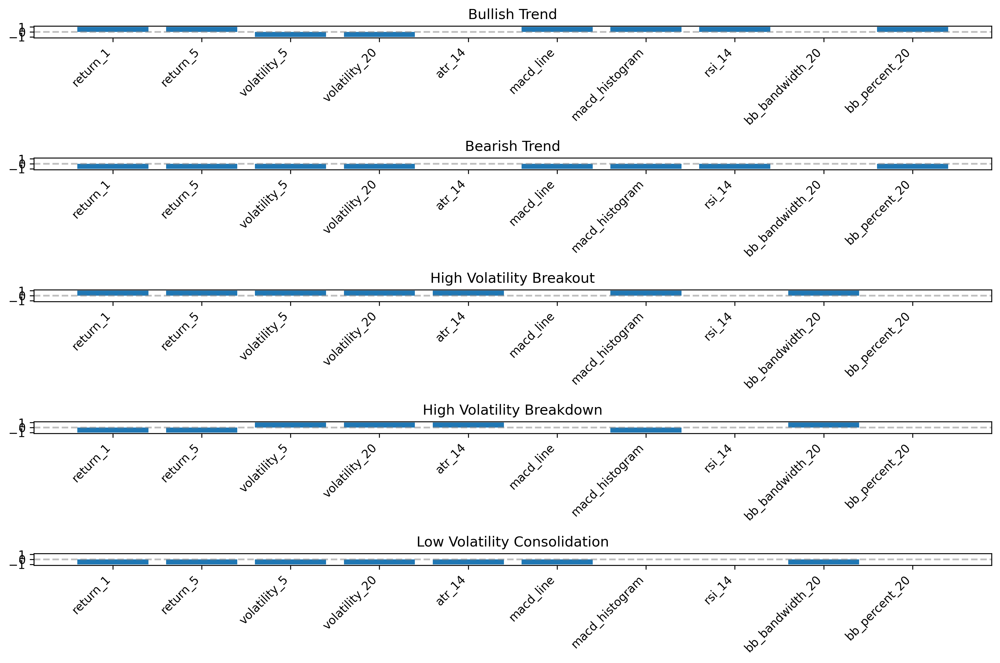

# Hopfield Network for Market Regime Analysis

[](https://www.python.org/downloads/)
[](https://opensource.org/licenses/MIT)

## 📊 Overview

This project applies neural physics to financial markets through a novel application of **Hopfield Networks** for identifying market regimes. The system identifies and classifies market states based on technical indicators, treating different market conditions as stable attractors in the network's energy landscape.

<p align="center">
  
</p>

### Why Hopfield Networks for Market Analysis?

Hopfield networks excel at pattern recognition and noise filtering, making them ideal for financial markets where:
- Market regimes show distinctive patterns across multiple indicators
- Price data contains significant noise that must be filtered out
- Regime transitions behave like state changes in physical systems

## 🔑 Key Features

### 1. Physics-Inspired Market Regime Classification
- **Pattern Recognition**: Uses content-addressable memory to recognize complex market patterns
- **Stable Attractors**: Market regimes are stable states in the network's energy landscape
- **Noise Reduction**: Effectively filters out market noise to identify underlying regimes

### 2. Comprehensive Technical Analysis Integration
- Automatically calculates and encodes key indicators (RSI, MACD, volatility measures)
- Transforms continuous indicator values into binary patterns for network processing
- Identifies 5 major market regimes: Bullish Trend, Bearish Trend, High Volatility Breakout, High Volatility Breakdown, and Low Volatility Consolidation

### 3. Robust Visualization Engine
- **Regime Overlay**: Visualizes market regimes directly on price charts
- **Transition Analysis**: Shows how markets move between different regimes
- **Return Distribution**: Analyzes performance metrics within each regime

### 4. Production-Ready Implementation
- Modular, well-documented codebase with comprehensive testing
- Efficient data acquisition and preprocessing pipeline
- Simple API for integration into trading systems

## 📈 Sample Visualizations

<table>
  <tr>
    <td width="50%">
      
      <p align="center"><em>Market Regimes Overlaid on Price Chart</em></p>
    </td>
    <td width="50%">
      
      <p align="center"><em>Regime Transition Heatmap</em></p>
    </td>
  </tr>
  <tr>
    <td width="50%">
      
      <p align="center"><em>Return Distributions by Regime</em></p>
    </td>
    <td width="50%">
      
      <p align="center"><em>Encoded Feature Patterns for Each Regime</em></p>
    </td>
  </tr>
</table>

## 🚀 Getting Started

### Installation

```bash
# Clone the repository
git clone https://github.com/yourusername/hopfield-market-regimes.git
cd hopfield-market-regimes

# Create a virtual environment
python -m venv venv
source venv/bin/activate  # On Windows: venv\Scripts\activate

# Install dependencies
pip install -r requirements.txt
```

### Quick Demo

Run the demo script to see the system in action:

```bash
python run_demo.py
```

This will:
1. Download recent SPY (S&P 500 ETF) data
2. Calculate technical indicators
3. Train the Hopfield network
4. Classify market regimes
5. Generate visualizations in the `results` directory

### Custom Analysis

```bash
# Analyze any ticker with custom parameters
python run_market_regime_classifier.py --ticker AAPL --period 2y --interval 1d

# Use a specific date range
python run_market_regime_classifier.py --ticker MSFT --start-date 2020-01-01 --end-date 2022-12-31
```

## 💻 Code Example

```python
from src.data.data_acquisition import DataAcquisition
from src.models.market_regime_classifier import MarketRegimeClassifier

# Fetch data
data_acq = DataAcquisition()
data = data_acq.fetch_data_yf(ticker='SPY', period='2y')
data = data_acq.clean_data(data).set_index('Date')

# Initialize market regime classifier
classifier = MarketRegimeClassifier()

# Prepare data and train
features_df, encoded_df, patterns, time_indices = classifier.prepare_data(data)
classifier.define_regimes(encoded_df)
hopfield_net = classifier.train_network()

# Classify market regimes
classification_df = classifier.classify_time_series(patterns, time_indices)

# Generate visualizations
fig = classifier.visualize_regime_classification(data, classification_df)
```

## 📋 Project Structure

```
.
├── data/               # Data storage
├── models/             # Saved models
├── notebooks/          # Jupyter notebooks
├── results/            # Analysis results
│   └── plots/          # Generated visualizations
├── src/                # Source code
│   ├── data/           # Data acquisition
│   ├── features/       # Feature engineering
│   ├── models/         # Core models
│   └── visualization/  # Visualization utilities
├── tests/              # Unit tests
├── requirements.txt    # Dependencies
└── README.md           # This file
```

## 🔍 Technical Details

### The Physics Behind the Market

The Hopfield network treats market regimes as attractors in a complex energy landscape:

- **Energy Function**: E = -0.5 * state^T * W * state
- **Weight Matrix**: Encodes relationships between technical indicators
- **Pattern Storage**: Uses Hebbian learning (neurons that fire together, wire together)
- **Dynamics**: Asynchronous updates that minimize system energy

### Market Regimes Identified

1. **Bullish Trend**: Strong momentum, low volatility, positive returns
2. **Bearish Trend**: Negative momentum, low volatility, negative returns
3. **High Volatility Breakout**: Strong momentum, high volatility, expanding price ranges
4. **High Volatility Breakdown**: Negative momentum, high volatility, panic selling
5. **Low Volatility Consolidation**: Sideways movement, contracting volatility, range-bound trading

## 🛠️ Advanced Usage

### Docker Support

```bash
# Run with Docker Compose
docker-compose up market-regime-classifier
```

### Jupyter Notebooks

```bash
# Start Jupyter server
jupyter notebook

# Open the demo notebook
notebooks/hopfield_market_regime_demo.ipynb
```

### Custom Regime Definitions

You can define your own market regimes by modifying the configuration in:
`src/features/feature_engineering.py`

## 📚 Further Reading

For in-depth theoretical background and implementation details, see the [PROJECT_SUMMARY.md](PROJECT_SUMMARY.md) document.

## 📄 License

MIT

---
